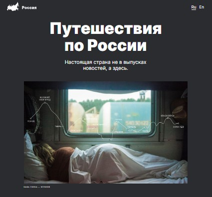

# Название проекта: **Путешествие по России**

Яндекс практикум "Веб-разработка"   (Спринт 3)

## Описание проекта:
Сайт создан с целью ознакомления посетителей с интересными местами России, которые можно посетить, путешествуя по Транссибирской магистрали от Москвы до Байкала. На сайте добавлены изображения и активные ссылки на описание мест на страничках в интернете.

## Технологии и функциональность:
* HTML:5;
* CSS;
* Flexbox;
* Grid Layout
* БЭМ;
* Позиционирование;
* Адаптивность
* Плавность перехода;

## Планы по доработке:
* Доработка проекта до отзывчивой верстки.
* Доработка возможности изменения языка страницы Ru/En.
* Создание попапа открытия изображений страницы.

[Проект на Github Pages](https://markrnd.github.io/russian-travel/)

[Ссылка на макет в Figma](https://www.figma.com/file/5S2WSbEFL6awjVWJ0NWL8Q/Sprint-3_-Russia-_-desktop-mobile?node-id=28503%3A0)
